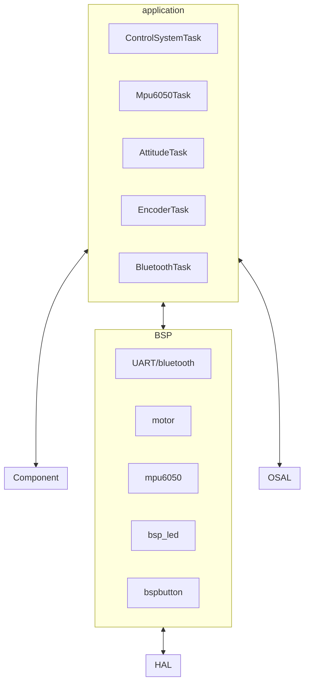
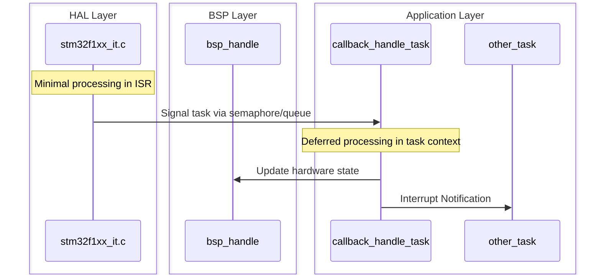

# ARCHITECTURE

## document information

- data:2026/3/10
- author : sam

## Overall Architecture Overview

```mermaid
graph TD
	subgraph application
	ControlSystemTask
	Mpu6050Task
	AttitudeTask
	EncoderTask
	BluetoothTask
	end
	subgraph OSAL
	end
	subgraph BSP
		UART/bluetooth
		motor
		mpu6050
		bsp_led
		bspbutton
	end
	subgraph Component
	end
	subgraph HAL
	end
	application <--> Component
	application <--> BSP
	application <-->OSAL
	BSP <--> HAL
```

## Interrupt handle

```mermaid
sequenceDiagram
    box HAL Layer
        participant IT as stm32f1xx_it.c
    end
box BSP Layer
    participant BSP as bsp_handle
end

box Application Layer
    participant CB as callback_handle_task
    participant OT as other_task
end

Note over IT: Minimal processing in ISR
IT->>CB: Signal task via semaphore/queue
Note over CB: Deferred processing in task context
CB->>BSP: Update hardware state
CB->>OT: Interrupt Notification

```
