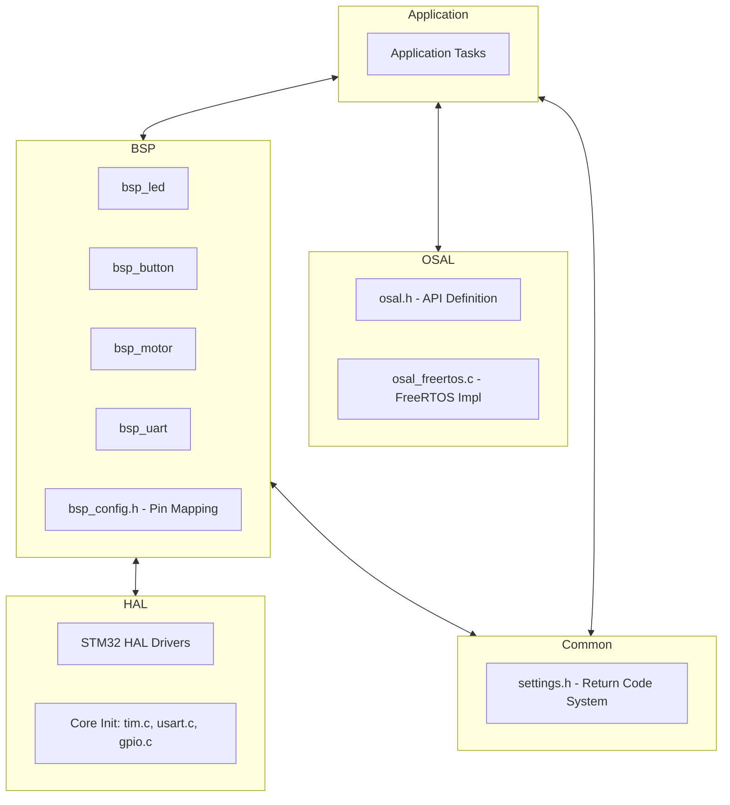
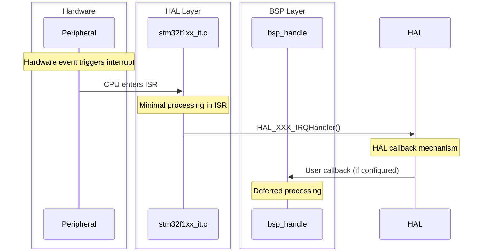
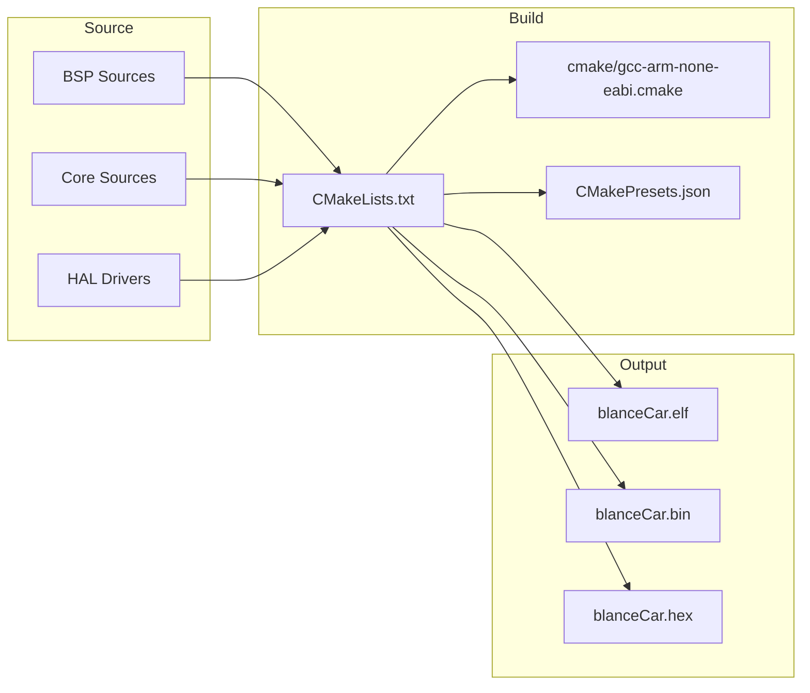

# ARCHITECTURE

## Document Information

- Date: 2026/4/28
- Author: sam

## Overall Architecture Overview



## Layer Description

### 1. HAL Layer (Hardware Abstraction Layer)

Generated by STM32CubeMX, provides low-level hardware access:

- **Core Initialization**: `Core/Src/tim.c`, `usart.c`, `gpio.c` - peripheral configuration
- **Interrupt Handlers**: `Core/Src/stm32f1xx_it.c` - ISR entry points
- **HAL Drivers**: `Drivers/STM32F1xx_HAL_Driver/` - ST official HAL library

### 2. BSP Layer (Board Support Package)

Hardware-specific drivers that encapsulate HAL calls:

| Module     | Files            | Description                                      |
| ---------- | ---------------- | ------------------------------------------------ |
| **LED**    | `bsp_led.c/h`    | Control 3 voltage indicator LEDs (PA4, PA5, PA6) |
| **Button** | `bsp_button.c/h` | User key button handler (PA11, rising edge IT)   |
| **Motor**  | `bsp_motor.c/h`  | Dual motor control with PWM + direction          |
| **UART**   | `bsp_uart.c/h`   | UART2 communication (PA2 TX, PA3 RX, 115200-8N1) |
| **Config** | `bsp_config.h`   | Centralized GPIO pin mapping definitions         |

#### BSP Motor Driver

- **PWM Control**: TIM1_CH1 (PA8) for left motor, TIM4_CH1 (PB6) for right motor
- **Direction Control**: IN1/IN2 pins for each motor (H-bridge)
- **Standby**: Shared STBY pin (PA1) enables/disables motor driver
- **API Functions**:
  - `BspMotorStart()` / `BspMotorStop()` - Start/stop motor
  - `BspMotorDection()` - Set direction (forward, backward, brake)
  - `BspMotorPWM()` - Set duty cycle (0.0 ~ 1.0)
  - `BspMotorGetId()` / `BspMotorGetDirection()` - Query status

#### BSP UART Driver

- **UART2**: 115200 baud, 8N1, TX=PA2, RX=PA3
- **API Functions**:
  - `BspUart2Init()` - Initialize UART (currently stub)
  - `BspUart2Send()` - Send raw data via UART
  - `BspUart2Printf()` - Formatted print via UART
  - `fputc()` / `fgetc()` - Redirect `printf`/`scanf` to UART2

#### BSP LED Driver

- 3 LEDs for voltage level indication
- **API**: `LedLightOn(LedId)` / `LedLightOff(LedId)`

#### BSP Button Driver

- User key button on PA11 (EXTI, rising edge trigger)
- **API**: `BspUserButtonHandeler()` / `BspUserButtonGetState()`

### 3. Common Layer

Shared project-wide definitions:

- **`Common/settings.h`**: Standardized 32-bit return code system
  - Format: `[success(1)][error_level(2)][module(5)][class(8)][code(16)]`
  - Modules: NONE(0x00), OSAL(0x01), HAL(0x02), UART(0x03), LED(0x04), Button(0x05), Motor(0x06)
  - Error Classes: Init, Parameter, Resource, Data, Hardware, State, Calibration

### 4. OSAL Layer (Operating System Abstraction Layer)

Portable RTOS abstraction interface (optional, not yet integrated):

- **osal.h**: Full API definition (tasks, semaphores, mutexes, queues, timers, event groups)
- **osal_freertos.c**: FreeRTOS implementation (available but commented out in CMakeLists.txt)
- See `OSAL/README.md` for detailed API documentation

### 5. Application Layer

Currently a placeholder (`Application/` directory exists but is empty). Application tasks will be added here in future development.

## Hardware Configuration

### Clock Tree

```
HSE (8MHz) → PLL (×9) → SYSCLK (72MHz)
                            ├── AHB (HCLK) = 72MHz
                            │   ├── APB1 (PCLK1) = 36MHz
                            │   └── APB2 (PCLK2) = 72MHz
                            └── Cortex-M3 = 72MHz
```

### GPIO Pin Allocation

| Pin  | Function             | Configuration         |
| ---- | -------------------- | --------------------- |
| PA1  | Motor STBY           | Output Push-Pull      |
| PA2  | USART2_TX            | AF Push-Pull          |
| PA3  | USART2_RX            | Input Floating        |
| PA4  | LED Voltage Level 1  | Output Push-Pull      |
| PA5  | LED Voltage Level 2  | Output Push-Pull      |
| PA6  | LED Voltage Level 3  | Output Push-Pull      |
| PA8  | TIM1_CH1 (Left PWM)  | AF Push-Pull          |
| PA9  | Left Motor IN1       | Output Push-Pull      |
| PA10 | Left Motor IN2       | Output Push-Pull      |
| PA11 | User Key Button      | Input, Rising Edge IT |
| PB5  | Right Motor IN1      | Output Push-Pull      |
| PB6  | TIM4_CH1 (Right PWM) | AF Push-Pull          |
| PB7  | Right Motor IN2      | Output Push-Pull      |

## Interrupt Handling

### Interrupt Vector Table

| Interrupt      | Priority | Handler Function         | Source             |
| -------------- | -------- | ------------------------ | ------------------ |
| TIM2_IRQn      | 0        | `TIM2_IRQHandler()`      | HAL timebase tick  |
| USART2_IRQn    | 0        | `USART2_IRQHandler()`    | UART communication |
| EXTI15_10_IRQn | 0        | `EXTI15_10_IRQHandler()` | PA11 button press  |

### Interrupt Flow



### Current Interrupt Handlers

1. **TIM2_IRQHandler**: Calls `HAL_TIM_IRQHandler(&htim2)` → `HAL_TIM_PeriodElapsedCallback()` → `HAL_IncTick()` (system timebase)
2. **USART2_IRQHandler**: Calls `HAL_UART_IRQHandler(&huart2)` (UART RX/TX handling)
3. **EXTI15_10_IRQHandler**: Calls `HAL_GPIO_EXTI_IRQHandler(GPIO_PIN_11)` (PA11 button)

## Return Code System

Defined in `Common/settings.h`, all functions return a 32-bit value:

```
Bit 31    : Success (0=error, 1=success)
Bits 29-30: Error level (0=minor, 1=medium, 2=major, 3=critical)
Bits 24-28: Module ID
Bits 16-23: Error class
Bits 0-15 : Error code (module-specific)
```

### Module IDs

| Module | ID   |
| ------ | ---- |
| NONE   | 0x00 |
| OSAL   | 0x01 |
| HAL    | 0x02 |
| UART   | 0x03 |
| LED    | 0x04 |
| Button | 0x05 |
| Motor  | 0x06 |

### Error Classes

| Class       | Range     | Examples                       |
| ----------- | --------- | ------------------------------ |
| Success     | 0x00      | ERR_TYPE_SUCCESS               |
| Init        | 0x01-0x0F | Init fail, timeout, not called |
| Parameter   | 0x10-0x1F | Invalid param, null pointer    |
| Resource    | 0x20-0x2F | Busy, timeout, no memory       |
| Data        | 0x30-0x3F | No data, corrupt, overflow     |
| Hardware    | 0x40-0x4F | Hardware fail, comm fail       |
| State/Logic | 0x50-0x5F | Invalid state, denied          |
| Calibration | 0x60-0x6F | Calibration required           |

## Build System



- **Toolchain**: GNU Arm Embedded Toolchain (`arm-none-eabi-gcc`)
- **Build System**: CMake 3.22+ with Ninja
- **Presets**: Debug (no optimization) and Release (-O2)
- **Linker Script**: `STM32F103XX_FLASH.ld` (128KB Flash, 20KB RAM)

## Future Development

- [ ] **Application Tasks**: Implement control system, sensor reading, and Bluetooth communication tasks
- [ ] **OSAL Integration**: Enable FreeRTOS via OSAL for task scheduling
- [ ] **MPU6050 Driver**: Add IMU sensor driver for balance control
- [ ] **Battery POWER** :Add battery power management
- [ ] **Encoder Driver**: Add motor encoder for speed measurement
- [ ] **PID Controller**: Implement balance control algorithm
